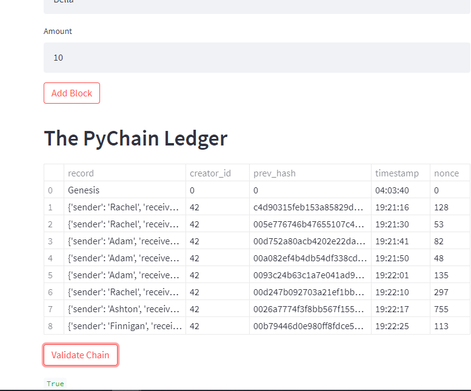
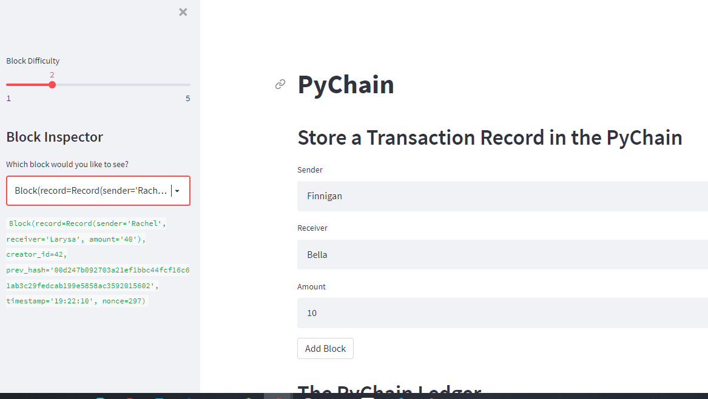

# Unit 18 Homework: PyChain Ledger - Rachel Pierce
## January 2022

## *Instructions:*
### Four main tasks:
1. Create a new data class named Record.
2. Modify the existing Block data class to store Record data.
3. Add Relevant User Inputs to the Streamlit interface.
4. Test the PyChain Ledger by Storing Records.

#
## *Please refer to the following documents in GitHub:*
- The **pychain.py** file (open in Spyder) for code details and the **screenshot_streamlit.png** and **screenshot_streamlit2.png** files in the images folder.

#

## Step 1: Create a new data class named Record - Completed.
```
@dataclass  
class Record:  
    sender: str  
    receiver: str  
    amount: float  
```

## Step 2: Modify the existing Block data class to store Record data - Completed.  
```
record: Record  
  ```
## Step 3: Add Relevant User Inputs to the Streamlit interface - Completed. 
 ```
sender = st.text_input("Sender")
receiver = st.text_input("Receiver")
amount = st.text_input("Amount")
 ```  
## Step 4: Test the PyChain Ledger by Storing Records - Completed in Streamlit.  
This task included entering values for sender, receiver, and amount several times to add transactions to the chain.  Then I clicked Validate, result = True.  Refer to screenshots.  

  
  
  
